Diese Übersicht zeigt Projekte an denen ich privat oder für die Uni/Schule gearbeitet habe.  
Die Liste ist keineswegs vollständig, aber das Ziel ist es zu den meisten Projekten mindestens ein Bild und eine kurze Beschreibung zu haben.  
Falls zu einzelnen Projekten Interesse an Quellcode oder Plänen besteht könnt ihr mich gerne anschreiben und ich schaue was ich noch dazu finden kann.

# tags
Robotik, ProgrammierAG, Software, Python, Uni, Minecraft, Basteln, Design, Mechanik  
(die Tags sollen vielleicht irgendwann für eine Filterfunktion benutzt werden, aber fürs erste versucht es einfach mit str+f)

# Laufende Projekte #

## DIY Fräse
tags: basteln, wip

|   |   |
|---|---|
|[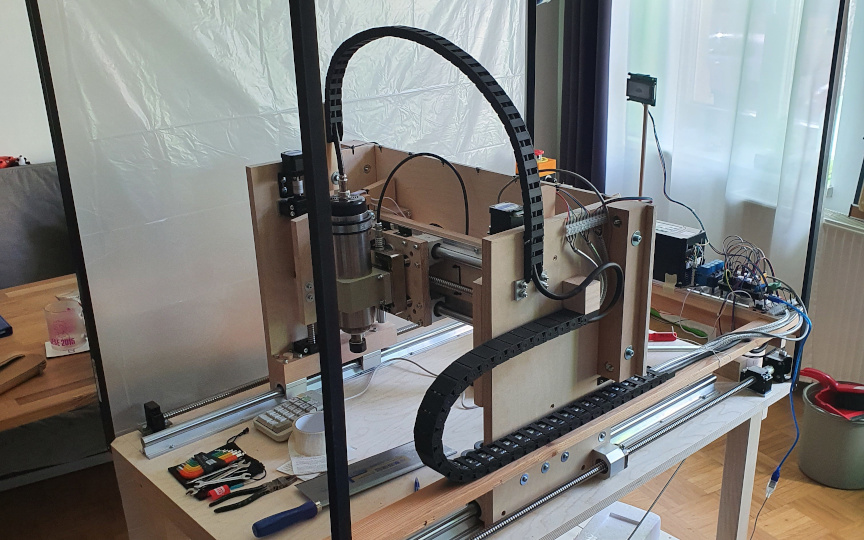](img/CNC/20220416_152508_16_10.jpg) ||

## Custom Laptop
aktueller Stand: mein Handy liefert zu wenig Strom für meinen USB-C Bildschirm und ich hab noch keinen Adapter gefunden der power injiziert aber DP alt mode durchschleift.

## MCG Craft
[github.com/Shildifreak/MCG_CRAFT](https://github.com/Shildifreak/MCG_CRAFT)  

Minecraft Clone für Bildungszwecke.

## Custom Scriptsprache (Kröt/ToadScript2.0/Cotton)
Ursprünglich für Shildimon entwickelte Scriptsprache.  
Codeblöcke sind Strings, Variablennamen sind Strings, Kommentare sind nicht immer Strings (sondern beziehen sich auf AST nodes), Whitespaces definieren ob operatoren binär oder unär sind, ...  

[https://shildimon.de/ToadScript/](https://shildimon.de/ToadScript/)

## Shildimon-Engine Shildimon-Spiel
Ein Spiel wofür ich die Idee in der 5. Klasse hatte und weshalb ich angefangen habe Programmieren zu lernen. Es ist bis jetzt nicht fertig geworden und aktuell arbeite ich auch nicht mehr aktiv daran.  
Es hat eine Custom Gameengine mit mehr oder weniger funktionierenden Netzwerkmodus. Eine Scriptsprache mit 3 Versionen von denen keine so richtig funktioniert. Viele Ideen auf Papier. Mehrere Landkarten. Ein paar Sammelkarten. Ein inzwischen nicht mehr zu erreichendes Wiki. Ein noch nicht geschriebenes Buch. etc. :D

[https://shildimon.de](https://shildimon.de)  
[https://github.com/Shildifreak/Shildimon](https://github.com/Shildifreak/Shildimon)

|   |   |   |   |
|---|---|---|---|
|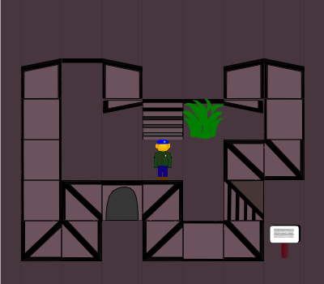|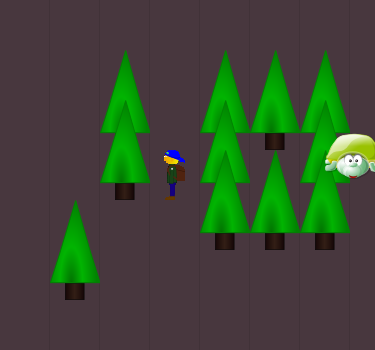|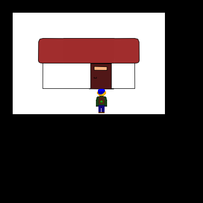|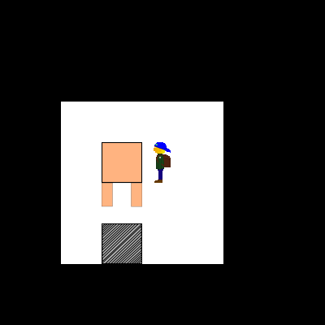|

# Beendete Projekte #

## Oszilloskop Display

Screengrabber -> Edge Detector -> Vectorizer -> Sampler -> Audio Card -> Oszilloskop

-> img/OsziTV

## Buchstützenmonitorstand

-> img/Buchstützenmonitorstand

## Schach
tags: Software, Python

Ein Konsolen Schachprogramm, das gebrauch von den Unicode Characteren für Schachfiguren macht.  
Es kennt die normalen Zugregeln für die Figuren, und kann Matt-/Pattpositionen erkennen.  
In der Implementierung fehlt jedoch noch eine Heuristik für den Computergegner, sowie Spezialzüge wie Rochade, Bauern umwandeln, Schlagen en passant, etc.

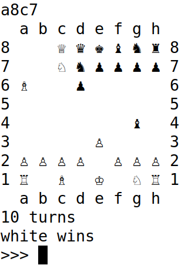

## Luftgewehr
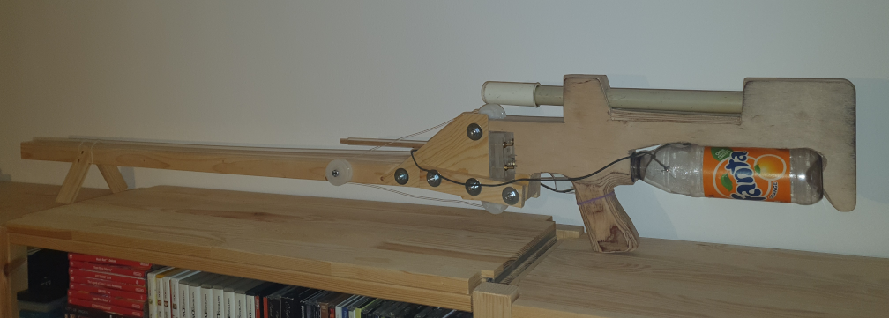

Gebaut aus einer alten Fahrradluftpumpe, Limo Flasche, Plexiglas und Sperrholz. (Funktioniert ungefähr so gut wie die Dinger aus dem Spielzeugladen, ist aber 10 mal so sperrig.)

## Mail based Login/Authentification for Website
## Xbox360 Guitar/Piano driver
## Laserpointer
tags: basteln, diy

Warum einen Laserpointer für 10-20€ kaufen wenn man die Dioden einzeln für unter 1€ bekommt?

|   |   |
|---|---|
|[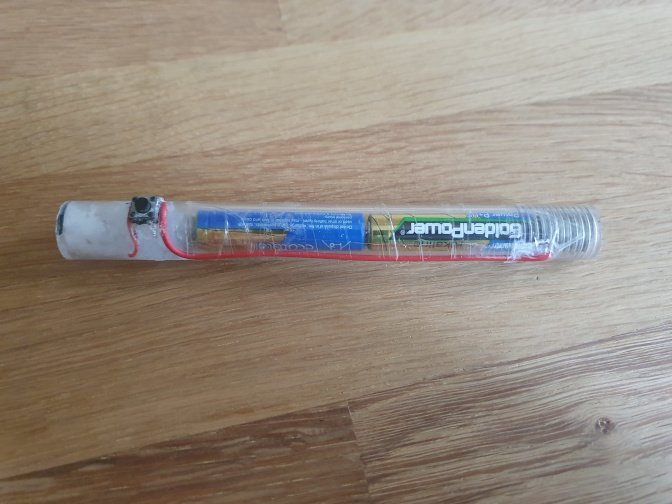](img/Laserpointer/20220606_191357.jpg) | [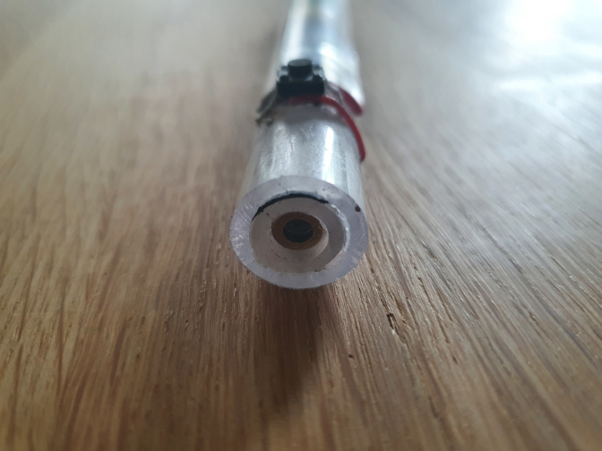](img/Laserpointer/20220606_191419.jpg) |

## Gameboy DMG SP Mod
-> img/DMGSP/
## PokeRom
-> img/PokeROM/
## Wifi Tisch
-> img/Tisch/
## Robotik
		<- Programmed them in nxc, python, and original mindstorms programming language
## Tafelroboter
## IMU Achterbahn Mapper
-> include pdf here
-> img/Achterbahnlog/
## Omnibot
## Ein-Motor-Bot
## BotArena
tags: ProgrammierAG
## MCGCRAFT
tags: Software, ProgrammierAG, Python, JavaScript, wip
## MooMooClone
## FlappyBirdClone

## MCGEM/Quest of Marie Curie
## Sudoku Helper
## Marsbuggy
## Luna
## KnockoutMaus
## Bomberman
## Intelligente Tastatur
tags: Software, Python

Diese Tastatur nutzt ein Markov Modell zur Textvorhersage. Trainiert wurde es auf dem Gesamtwerk von Goethe   
Die 6 wahrscheinlichsten nächsten Buchstaben lassen sich ohne Abheben des Fingers schreiben.  
Weil am Rand weniger Vorschläge angezeigt werden können werden die Buchstaben so angeordnet, dass die wahrscheinlichsten Optionen in Richtung Bildschirmmitte führen.

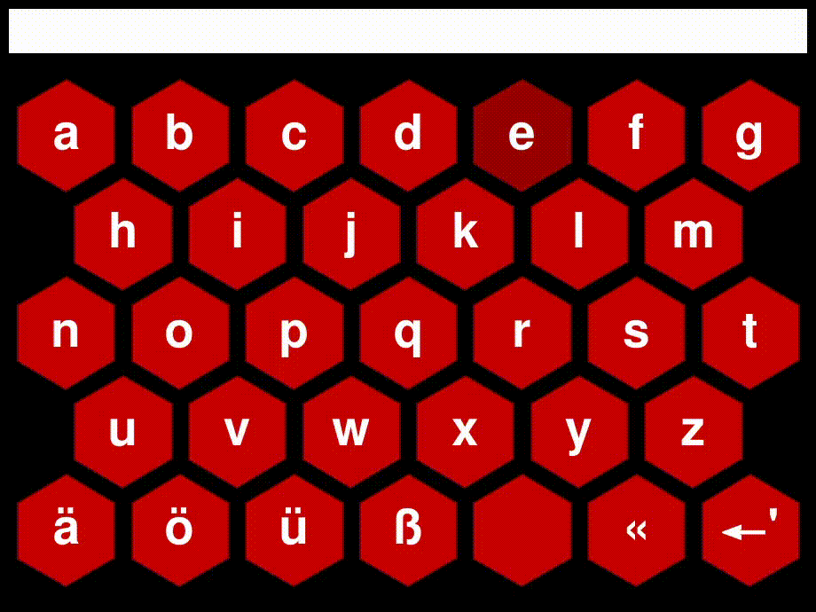

## SoftwaretechnologieProjekt
tags: uni
## Pathfinding Lidar Roboter
## Particle Simulation on Manifold
## Image Recognition Bewerbung

## Betondrucker
tags: Minecraft, redstone

Maybe the fastest minecraft survival friendly concrete powder printer on youtube right now. (If you ignore the reset time of up to 1min as some commenters pointed out.)
Created as a response to Mumbos Video in which he challenged the community to improve his idea of a redstone based printer.

## Sortiersystem
tags: Minecraft, redstone

[https://youtube.com/playlist?list=PL-k0J6ByCNTzkA2IiJPEQfT9T1AgNUdpS](https://youtube.com/playlist?list=PL-k0J6ByCNTzkA2IiJPEQfT9T1AgNUdpS)

## Armor Sorting with Zombies
tags: Minecraft, redstone

## Kompassmenü
tags: Minecraft, commands

[https://youtube.com/playlist?list=PL-k0J6ByCNTzFM6ILWny585HMb7OUEjtP](https://youtube.com/playlist?list=PL-k0J6ByCNTzFM6ILWny585HMb7OUEjtP)

## Bukkit-Mods
tags: Minecraft, mods

Schlittschuhe, AdvancedKeepInventory

# Skat Reizrechner
tags: basteln
aus mehreren Lagen Karton, mit tabs zum einschieben/rausziehen (4 für buben + 1 für Farbe/Grand) und zwei Fenstern, in einem der Fenster ist zu sehen bis wohin man reizen darf.

{image to be inserted here}

## Leuchtestern
tags: basteln

Sternförmiger Infinity Mirror aus Plexiglas mit RGB-LED Streifen entlang des Umfangs.

## Knatterboot
tags: Uni, basteln

Entstanden im Rahmen des Weihnachtsbastelns der Professur für Formgebende Fertigungsverfahren.  
Beim Bau dieses Bootes wurden die Techniken Sägen, Schneiden, Biegen, Löten und Kleben genutzt.  
Was ist ein Knatterboot: [https://de.wikipedia.org/wiki/Knatterboot](https://de.wikipedia.org/wiki/Knatterboot)

|   |   |
|---|---|
| [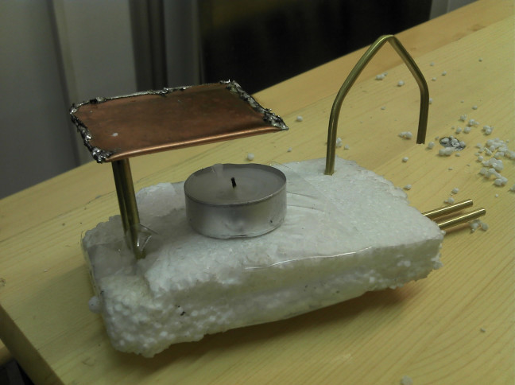](img/Knatterboot/IMG_20161221_194736.jpg) | [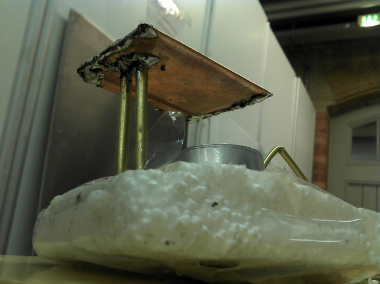](img/Knatterboot/IMG_20161221_194750.jpg) |

## Handyhülle
tags: basteln, nähen, diy

Eine langlebige Handyhülle zum zuklappen mit Tasche auf der Innenseite der Klappe und magnetischer Schnalle.
Die Grundlage bildet ein etwa quadratisches Stück Leder, mit einem ausragendem Streifen in der Mitte des rechted Randes als Schnalle. In die rechte Hälfte des Leders sind Löcher geschnitten für Kamera und Lautsprecher (relevant nur für Handys mit Lautsprecher auf der Rückseite) und darauf ist eine einfache gekauft Hartgummihülle geklebt.
Die linke Seite wird zur Deckklappe der Hülle. Auf der Innenseite der Deckklappe ist ein kleineres Stück Leder als Tasche für Karten, Bilder und ähnliches aufgenäht.
Zur Verstärkung der Deckklappe dient eine Schnitt und Stoßsichere Plastikplatte mit gerundeten Ecken. In diese sind entlang des Randes kleine Löcher gebohrt und dadurch sind das Leder und die in Stoff eingeschlagene Plastikplatte vernäht.

-> img/Handyhülle/

## Umrührtasse
tags: basteln, diy

Es gibt Tassen zu kaufen, die einen kleinen Motor mit Paddel in den Boden eingebaut haben und auf Kopfdruck ihren Inhalt umrühren können. Aus den Rezensionen für diese Produkte kann man aber schnell erkennen, dass die Lebensdauer nicht sehr groß ist, meist weil die Dichtung versagt wo die Achse durch den Boden der Tasse geführt ist.
Weil die Tasse als Geschenk gedacht war und ich keinen Schrott verschenken wollte habe ich stattdessen eine Version mit Rührfisch gebaut.
Diese lässt sich leichter reinigen und läuft nicht Gefahr undicht zu werden.
Allerdings war der genutzte Motor aus einem alten batteriebetriebenen Handventilator nicht stark genug und man musste dem Rührfisch immer erst noch einen Schubs geben damit er anfing sich zu drehen.
Es könnte sich lohnen nochmal eine Version zwei dieses Projektes zu bauen.

## Schaumkussschleuder
tags: basteln, Holz

Dieses Gerät ist als Spiel für Kindergeburtstage entstanden.
Man wirft mit einem Ball gegen die Zielscheibe. Wenn diese getroffen wird fällt sie nach hinten auf die eine Seite einer Wippe.	Der auf der anderen Seite der Wippe liegende Wurfarm wird aus dem Totpunkt herausgehoben und wirft durch die Kraft der gespannten Feder einen Schaumkuss in Richtung des Spielers. Dieser versucht dann, im Idealfall nur mit dem Mund, den Schaumkuss zu fangen.
Es ist einem Exemplar nachempfunden dass ich mal auf einem Straßenfest gesehen habe, wobei der Entriegelungsmechanismus dort anders war.

{todo: Bild auftreiben}

[//]: # (Wasserluftrakete?)

## Kopfhörerreparatur
tags: basteln, diy, repair

Nachrüsten einer 3.5mm Klinke Buchse in meine Sennheiser HD205 Kopfhörer.  
Aus eigener Erfahrung kann ich sagen, dass Kopfhörer meist viele Jahre länger halten als ihre Kabel.  
Außerdem kann es mitunter praktisch sein für verschiede Zwecke unterschiedlich lange Kabel oder Kabel mit und ohne eingebautem Microphon benutzen zu können.

|   |   |
|---|---|
| [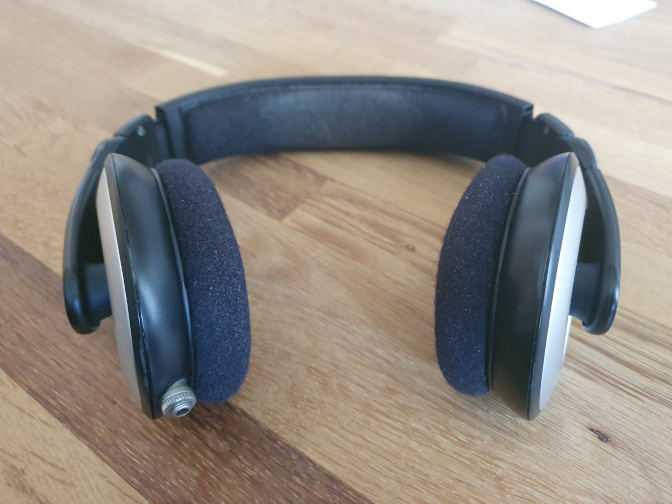](img/HD205-Klinkenbuchse/20220622_111423.jpg) | [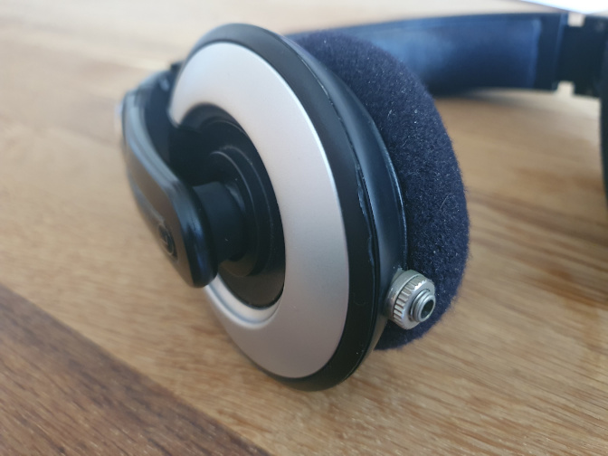](img/HD205-Klinkenbuchse/20220622_111548.jpg) |

## Teamgeist
tags: basteln, nähen

Der Teamgeist ist das aus einem Scherz entstandene Maskottchen des FLL Teams MCGBots.  
Er ist ca. 30cm groß, seine Form ist den Geistern aus Pacman nachempfunden und er begleitet das Team jetzt seit vielen Jahren zu den Roboterwettbewerben.

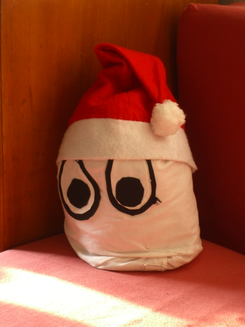

## Auto mit Allradlenkung
tags: Design

Design für ein Auto mit lenkbaren Vorder- und Hinterrädern.  
Gelenkt werden die Räder durch zwei konzentrisch hintereinander angebrachte Lenkräder.  
Unter anderem kann das Auto damit ohne Haftungsverlust "driften" und komfortabel seitwärts einparken.  
(Bei einem 90° Einschlagwinkel der Räder könnte es sogar auf der Stelle drehen.)

## Crossdriven Omniwheel
tags: Design, Mechanik

Design für ein in zwei Achsen antreibbares Omniwheel.  
Nicht im Bild gezeigt: Die vier umlaufenden Stirnräder werden über das Differential zwischen zwei großen Kronenrädern angetrieben. Die die Lauffläche bildenden Walzen sind über Kegelräder oder flexible Wellen mit ihren Nachbarn gekoppelt.  
Inspiriert durch ein Video von James Bruton: [https://youtu.be/byUo4EagXu0](https://youtu.be/byUo4EagXu0)

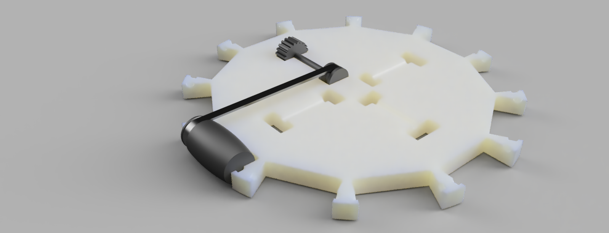

